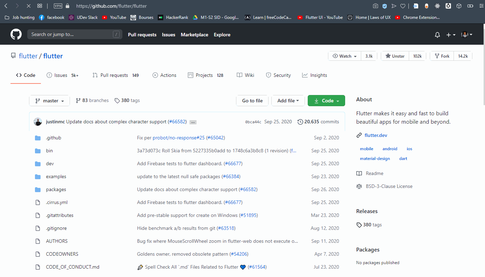

# Inception Browser Extension

 

## Motivation
It is quite fun to get to see how some enourmous projects out there were started from literally one file, I don't know maybe I'm weird!

## Desciption
Inception is a browser extension _(and my pet project)_ that when installed allows the user to travel to the very first commit of any gihtub reporisitory, even the ones with tens of thousands of commits history (which makes it quite impossibe to do using the UI navigation provided by github, I believe).

## Demonstration

## Browsers support
* Opera
* Chrome

## Installation
1. Download (unzip afterward) or clone this repo locally.
2. Open your browser and go to extensions.
3. Enable developer mode
4. Click on "load unpackaged extension" and choose the folder holding the files
5. Et Voila! (<b>IMPORTANT: Don't delete the folder after installation</b>)

## TODOs
- [x] Make it work!
- [x] Create the popup screen.
- [ ] In web page button enabling/disable toggle.
- [ ] Clean code

## Future enhancements
Essentially this is meant to be a smoother way to navigate commits history on gihtub, maybe even provide a timelapse kind of view over projects.

* Navigate to commit by number/order and branche.
* Next & previous commits button maybe.
* Testing with various browsers' versions.
